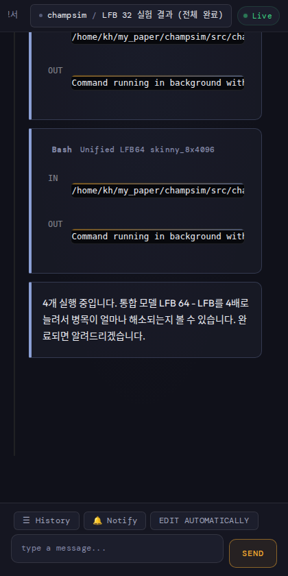
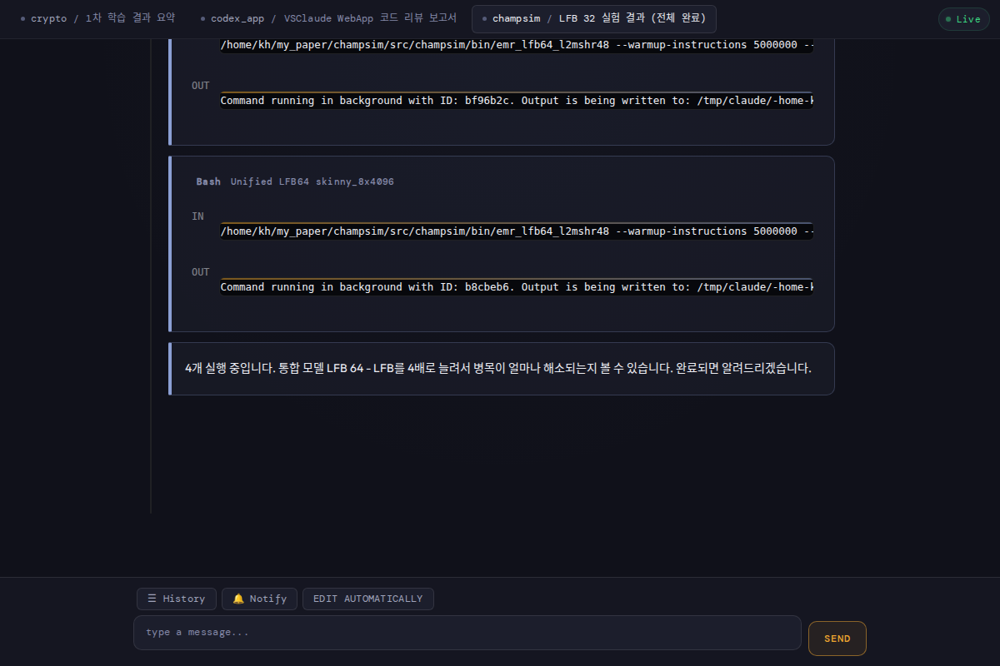

# VSClaude WebApp

> Monitor and interact with **Claude Code** (VS Code) sessions from your phone or any browser.

Claude Code tasks can run for a long time. This web app lets you watch the conversation in real time and send messages — without sitting in front of your PC.

<p align="center">
  
  &nbsp;&nbsp;&nbsp;
  
</p>

## Why?

- **Monitor from anywhere** — check Claude Code progress from your phone while AFK
- **Send messages remotely** — type prompts and submit directly from mobile
- **Manage multiple sessions** — switch between cascade tabs at a glance
- **Never miss a response** — get push notifications when Claude replies

## Features

| Feature | Description |
|---------|-------------|
| **Live Snapshot** | Periodically captures HTML from the Claude Code webview via CDP |
| **Multi-Tab** | Switch between multiple cascades as tabs |
| **Message Injection** | Type and send messages to Claude Code from your phone |
| **User/Assistant Detection** | 7-strategy cascade to accurately distinguish user vs. assistant turns |
| **Push Notifications** | Web Push API notifications (PWA) |
| **Auto-Edit Mode** | Toggle automatic approval mode |
| **Responsive UI** | Works on mobile (420px) through desktop (1200px+) |

## Architecture

```
VS Code (CDP:9222)
    │
    ├─ Chrome DevTools Protocol
    │
Server (Node.js + Express)
    ├─ lib/discovery.js   ← CDP target discovery & snapshot polling
    ├─ lib/cdp.js         ← HTML capture, message injection, turn detection
    ├─ lib/config.js      ← Environment-based configuration
    ├─ lib/push.js        ← Web Push (VAPID) management
    ├─ server.js          ← HTTP API + WebSocket broadcast
    │
    ├─ WebSocket (real-time updates)
    │
Browser / Mobile (PWA)
    ├─ public/index.html
    ├─ public/js/app.js   ← Client-side rendering & interaction
    └─ public/css/style.css
```

## Setup

### 1. Launch VS Code with CDP enabled

```bash
code --remote-debugging-port=9222
```

### 2. Install & Run

```bash
cd vsclaude-webapp
npm install
node server.js
```

### 3. Open on your phone

Open `http://<your-local-ip>:3000` in a mobile browser. Make sure your phone is on the same Wi-Fi network.

### HTTPS (optional, required for Push Notifications)

```bash
mkdir certs
openssl req -x509 -newkey rsa:2048 -keyout certs/key.pem -out certs/cert.pem -days 365 -nodes
```

The server automatically detects `certs/` and starts HTTPS on port 3443.

## Configuration

Environment variables (all optional):

| Variable | Default | Description |
|----------|---------|-------------|
| `CLAUDE_CDP_PORT_RANGE` | `9222-9230` | CDP port range to scan |
| `CLAUDE_DISCOVERY_INTERVAL` | `5000` | Target discovery interval (ms) |
| `CLAUDE_POLL_INTERVAL` | `2000` | Snapshot polling interval (ms) |

## Security

- **Local network only** — accessible only within your LAN / Wi-Fi
- Never expose the CDP port to the public internet
- When using HTTPS with a self-signed certificate, you'll need to accept it manually in the browser
- I recommend you to use Zerotier or tailscale if you need.

## Tech Stack

- **Runtime**: Node.js (ESM)
- **Server**: Express + ws (WebSocket)
- **CDP**: Chrome DevTools Protocol (direct HTTP/WebSocket)
- **Push**: web-push (VAPID)
- **Client**: Vanilla JS (no framework), PWA

## License

[MIT](LICENSE)
